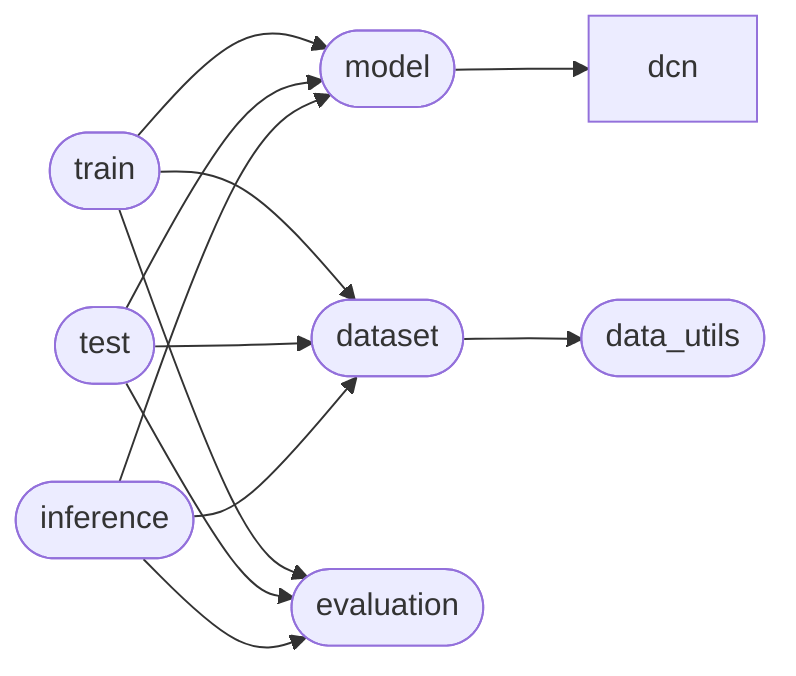

# Code Overview

[_Documentation generated by Documatic_](https://www.documatic.com)

<!---Documatic-section-Codebase Structure Python-start--->
## Codebase Structure Python

The codebase has a 2-deep folder structure,
                with 13 code files in total.

<!---Documatic-block-system_architecture-start--->

<!---Documatic-block-system_architecture-end--->

# #
<!---Documatic-section-Codebase Structure Python-end--->

<!---Documatic-section-Important Functions-start--->
## Important Functions

<!---Documatic-block-important_funcs-start--->
<!---Documatic-block-most_used_funcs-start--->
### Most Utilised Functions

* [code.dataset.augumentation](3-code_dataset.md#code.dataset.augumentation) (3 times)
* [code.evaluation.psnr2](4-code_evaluation.md#code.evaluation.psnr2) (2 times)
* [code.evaluation.ssim](4-code_evaluation.md#code.evaluation.ssim) (2 times)
* code.data_utils.add_light (1 times)
* code.data_utils.add_noise (1 times)
* code.data_utils.random_crop (1 times)
* code.data_utils.rgb2ycbcr (1 times)
* code.data_utils.ycbcr2rgb (1 times)
* [code.evaluation.psnr](4-code_evaluation.md#code.evaluation.psnr) (1 times)
<!---Documatic-block-most_used_funcs-end--->
<!---Documatic-block-important_funcs-end--->

# #
<!---Documatic-section-Important Functions-end--->

<!---Documatic-section-File IO-start--->
## File IO

<!---Documatic-block-file_io-start--->
The following files have file read operations

<!---Documatic-block-code-start--->

	
<code>code</code> (Click to Expand!)

* code.dataset

<!---Documatic-block-code-end--->
<!---Documatic-block-file_io-end--->

# #
<!---Documatic-section-File IO-end--->

<!---Documatic-section-Class Hierarchy-start--->
## Class Hierarchy

<!---Documatic-block-Dataset-start--->

	
<code>Dataset</code> (Click to Expand!)

* code.dataset.InferLoader
* code.dataset.TestSetLoader
* code.dataset.TestSetLoader_Vimeo
* code.dataset.TrainSetLoader
* code.dataset.ValidSetLoader

<!---Documatic-block-Dataset-end--->

<!---Documatic-block-code.dcn.functions.deform_conv_func.DeformConvFunction-start--->

	
<code>code.dcn.functions.deform_conv_func.DeformConvFunction</code> (Click to Expand!)

* code.dcn.functions.deform_conv_func.DeformConvFunction

<!---Documatic-block-code.dcn.functions.deform_conv_func.DeformConvFunction-end--->

<!---Documatic-block-code.dcn.modules.deform_conv.DeformConv-start--->

	
<code>code.dcn.modules.deform_conv.DeformConv</code> (Click to Expand!)

* code.dcn.modules.deform_conv.DeformConvPack

<!---Documatic-block-code.dcn.modules.deform_conv.DeformConv-end--->

<!---Documatic-block-code.dcn.modules.deform_conv.DeformConv_d-start--->

	
<code>code.dcn.modules.deform_conv.DeformConv_d</code> (Click to Expand!)

* code.dcn.modules.deform_conv.DeformConvPack_d

<!---Documatic-block-code.dcn.modules.deform_conv.DeformConv_d-end--->

<!---Documatic-block-nn.Module-start--->

	
<code>nn.Module</code> (Click to Expand!)

* code.dcn.modules.deform_conv.DeformConv
* code.dcn.modules.deform_conv.DeformConv_d
* code.model.Net

<!---Documatic-block-nn.Module-end--->

<!---Documatic-block-object-start--->

	
<code>object</code> (Click to Expand!)

* [code.dataset.augumentation](3-code_dataset.md#code.dataset.augumentation)

<!---Documatic-block-object-end--->

# #
<!---Documatic-section-Class Hierarchy-end--->

[_Documentation generated by Documatic_](https://www.documatic.com)