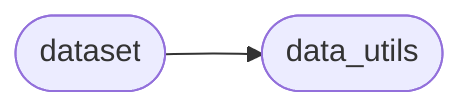

# Code Dataset

[_Documentation generated by Documatic_](https://www.documatic.com)

<!---Documatic-section-Codebase Structure-start--->
## Codebase Structure

<!---Documatic-block-system_architecture-start--->

<!---Documatic-block-system_architecture-end--->

# #
<!---Documatic-section-Codebase Structure-end--->

<!---Documatic-section-code.dataset.augumentation-start--->
## [code.dataset.augumentation](3-code_dataset.md#code.dataset.augumentation)

<!---Documatic-section-augumentation-start--->
<!---Documatic-block-code.dataset.augumentation-start--->
<details>
	<summary><code>code.dataset.augumentation</code> code snippet</summary>

```python
class augumentation(object):

    def __call__(self, input, target):
        if random.random() < 0.5:
            input = input[::-1, :, :]
            target = target[::-1, :, :]
        if random.random() < 0.5:
            input = input[:, ::-1, :]
            target = target[:, ::-1, :]
        if random.random() < 0.5:
            input = input.transpose(0, 1, 3, 2)
            target = target.transpose(0, 1, 3, 2)
        return (input, target)
```
</details>
<!---Documatic-block-code.dataset.augumentation-end--->
<!---Documatic-section-augumentation-end--->

# #
<!---Documatic-section-code.dataset.augumentation-end--->

[_Documentation generated by Documatic_](https://www.documatic.com)