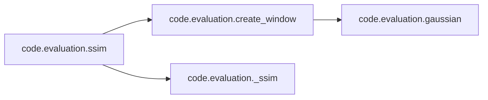
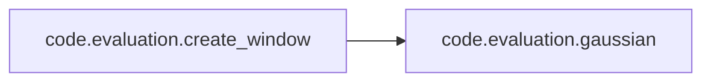

# Code Evaluation

[_Documentation generated by Documatic_](https://www.documatic.com)

<!---Documatic-section-Codebase Structure-start--->
## Codebase Structure

<!---Documatic-block-system_architecture-start--->
```mermaid
None
```
<!---Documatic-block-system_architecture-end--->

# #
<!---Documatic-section-Codebase Structure-end--->

<!---Documatic-section-code.evaluation.psnr2-start--->
## [code.evaluation.psnr2](4-code_evaluation.md#code.evaluation.psnr2)

<!---Documatic-section-psnr2-start--->
<!---Documatic-block-code.evaluation.psnr2-start--->
<details>
	<summary><code>code.evaluation.psnr2</code> code snippet</summary>

```python
def psnr2(img1, img2):
    img1 = (img1 * 255.0).int()
    img2 = (img2 * 255.0).int()
    img1 = img1.float() / 255.0
    img2 = img2.float() / 255.0
    img1_ = img1[:, :, 8:-8, 8:-8]
    img2_ = img2[:, :, 8:-8, 8:-8]
    mse = torch.sum((img1_ - img2_) ** 2, [1, 2, 3]) / img1_[0, ...].numel()
    out = 10 * torch.log10(1 / mse)
    return out
```
</details>
<!---Documatic-block-code.evaluation.psnr2-end--->
<!---Documatic-section-psnr2-end--->

# #
<!---Documatic-section-code.evaluation.psnr2-end--->

<!---Documatic-section-code.evaluation.ssim-start--->
## [code.evaluation.ssim](4-code_evaluation.md#code.evaluation.ssim)

<!---Documatic-section-ssim-start--->


### Object Calls

* [code.evaluation.create_window](4-code_evaluation.md#code.evaluation.create_window)
* [code.evaluation._ssim](4-code_evaluation.md#code.evaluation._ssim)

<!---Documatic-block-code.evaluation.ssim-start--->
<details>
	<summary><code>code.evaluation.ssim</code> code snippet</summary>

```python
def ssim(img1, img2, window_size=11, size_average=False):
    (_, channel, h, w) = img1.size()
    img1_ = img1[:, :, 8:-8, 8:-8]
    img2_ = img2[:, :, 8:-8, 8:-8]
    window = create_window(window_size, channel)
    if img1.is_cuda:
        window = window.cuda(img1_.get_device())
    window = window.type_as(img1_)
    return _ssim(img1_, img2_, window, window_size, channel, size_average)
```
</details>
<!---Documatic-block-code.evaluation.ssim-end--->
<!---Documatic-section-ssim-end--->

# #
<!---Documatic-section-code.evaluation.ssim-end--->

<!---Documatic-section-code.evaluation.psnr-start--->
## [code.evaluation.psnr](4-code_evaluation.md#code.evaluation.psnr)

<!---Documatic-section-psnr-start--->
<!---Documatic-block-code.evaluation.psnr-start--->
<details>
	<summary><code>code.evaluation.psnr</code> code snippet</summary>

```python
def psnr(img1, img2):
    img1 = (img1 * 255.0).int()
    img2 = (img2 * 255.0).int()
    img1 = img1.float() / 255.0
    img2 = img2.float() / 255.0
    img1_ = img1[:, :, 8:-8, 8:-8]
    img2_ = img2[:, :, 8:-8, 8:-8]
    mse = torch.sum((img1_ - img2_) ** 2) / img1_.numel()
    psnr = 10 * log10(1 / mse)
    return psnr
```
</details>
<!---Documatic-block-code.evaluation.psnr-end--->
<!---Documatic-section-psnr-end--->

# #
<!---Documatic-section-code.evaluation.psnr-end--->

<!---Documatic-section-code.evaluation._ssim-start--->
## [code.evaluation._ssim](4-code_evaluation.md#code.evaluation._ssim)

<!---Documatic-section-_ssim-start--->
<!---Documatic-block-code.evaluation._ssim-start--->
<details>
	<summary><code>code.evaluation._ssim</code> code snippet</summary>

```python
def _ssim(img1, img2, window, window_size, channel, size_average=True):
    mu1 = F.conv2d(img1, window, padding=window_size // 2, groups=channel)
    mu2 = F.conv2d(img2, window, padding=window_size // 2, groups=channel)
    mu1_sq = mu1.pow(2)
    mu2_sq = mu2.pow(2)
    mu1_mu2 = mu1 * mu2
    sigma1_sq = F.conv2d(img1 * img1, window, padding=window_size // 2, groups=channel) - mu1_sq
    sigma2_sq = F.conv2d(img2 * img2, window, padding=window_size // 2, groups=channel) - mu2_sq
    sigma12 = F.conv2d(img1 * img2, window, padding=window_size // 2, groups=channel) - mu1_mu2
    C1 = 0.01 ** 2
    C2 = 0.03 ** 2
    ssim_map = (2 * mu1_mu2 + C1) * (2 * sigma12 + C2) / ((mu1_sq + mu2_sq + C1) * (sigma1_sq + sigma2_sq + C2))
    if size_average:
        return ssim_map.mean()
    else:
        return ssim_map.mean(1).mean(1).mean(1)
```
</details>
<!---Documatic-block-code.evaluation._ssim-end--->
<!---Documatic-section-_ssim-end--->

# #
<!---Documatic-section-code.evaluation._ssim-end--->

<!---Documatic-section-code.evaluation.create_window-start--->
## [code.evaluation.create_window](4-code_evaluation.md#code.evaluation.create_window)

<!---Documatic-section-create_window-start--->


### Object Calls

* code.evaluation.gaussian

<!---Documatic-block-code.evaluation.create_window-start--->
<details>
	<summary><code>code.evaluation.create_window</code> code snippet</summary>

```python
def create_window(window_size, channel):
    _1D_window = gaussian(window_size, 1.5).unsqueeze(1)
    _2D_window = _1D_window.mm(_1D_window.t()).float().unsqueeze(0).unsqueeze(0)
    window = Variable(_2D_window.expand(channel, 1, window_size, window_size).contiguous())
    return window
```
</details>
<!---Documatic-block-code.evaluation.create_window-end--->
<!---Documatic-section-create_window-end--->

# #
<!---Documatic-section-code.evaluation.create_window-end--->

[_Documentation generated by Documatic_](https://www.documatic.com)